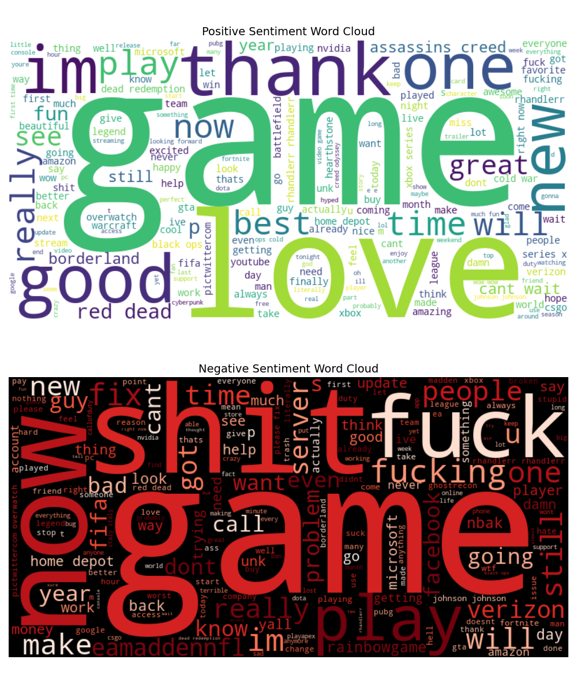

# PRODIGY_DS_04

# 📊 Sentiment Analysis of Social Media Data

Analyze and visualize sentiment patterns in social media data to understand public opinion and attitudes towards specific topics or brands.

## 📌 Overview
This project performs **sentiment analysis** on social media text data and generates **word clouds** for **Positive** and **Negative** sentiments.

## 📂 Dataset  

The dataset used for this analysis is available on Kaggle:  

[**Twitter Entity Sentiment Analysis Dataset**](https://www.kaggle.com/datasets/jp797498e/twitter-entity-sentiment-analysis)  

⚠️ **Note:** Download the dataset manually and place `twitter_training.csv` in the project directory.

## 🔧 Installation & Setup

### **1️⃣ Clone the Repository**
```bash
git clone https://github.com/Aysaal191666/PRODIGY_DS_04.git
cd Sentiment-Analysis
```

### 2️⃣ Install Dependencies
```
pip install -r requirements.txt

```

###3️⃣ Run the Analysis
Execute the Python script:
```
bash
Copy
Edit
python sentiment_analysis.py
```
## 📊 Output Results

### ✅ Sentiment Word Clouds
Positive and negative word clouds generated from the dataset:




